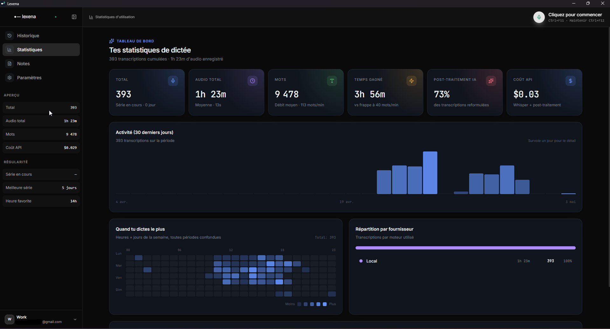
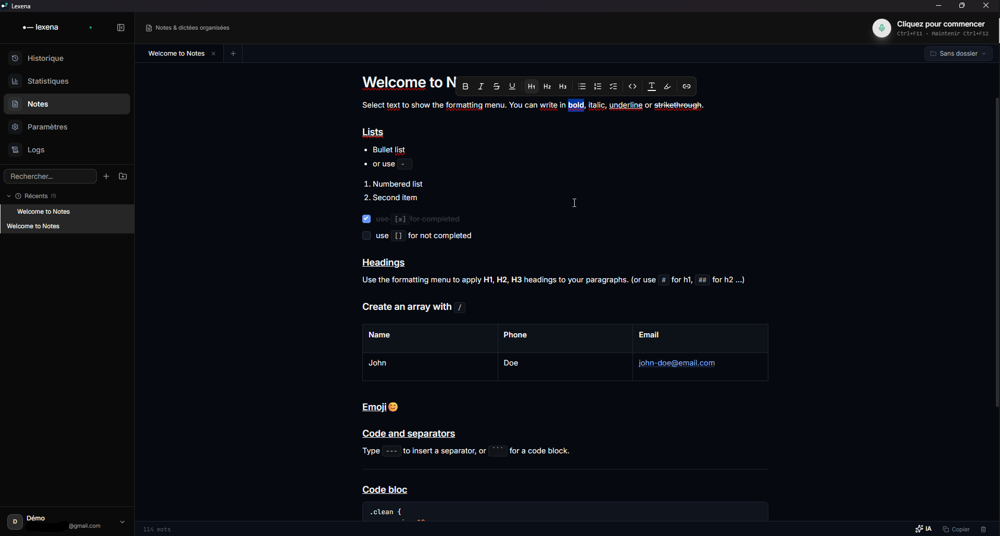
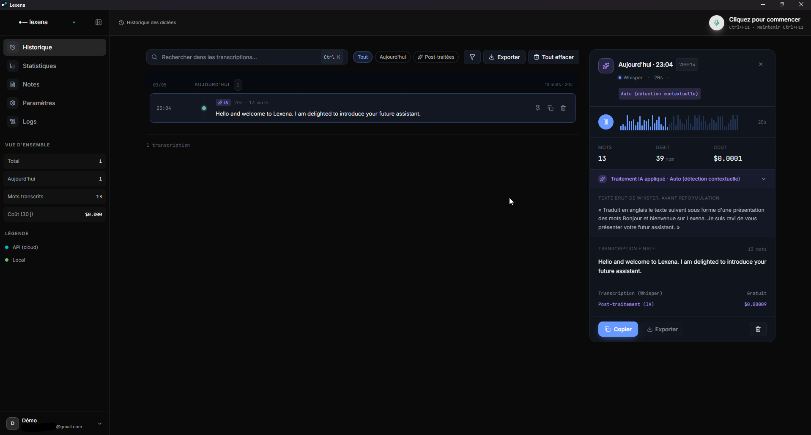

<p align="center">
  
</p>

<h1 align="center">Lexena</h1>

<p align="center">
  AI-powered voice dictation, notes, and personal vocabulary — for your Windows desktop.
</p>

<p align="center">
  <a href="https://github.com/Nolyo/lexena/releases"></a>
  
  
  <a href="LICENSE"></a>
  
</p>

> **Lexena 3.0 is in public Beta.** The core experience is stable; we are polishing things and shipping new capabilities frequently.

## Highlights

- 🎤 **Push-to-talk dictation** with configurable global hotkeys, instant insertion into any active window.
- 📝 **Built-in notes** — rich text editor with folders, backlinks, code blocks, tables, and task lists.
- 📊 **Personal dashboard** — streaks, time saved, top words, activity heatmap.
- 👤 **Multi-profile** — fully isolated workspaces per profile.
- ☁️ **Optional account & sync** — preferences, dictionary, and snippets follow you across devices.
- 🔒 **Offline or cloud transcription** — your choice.
- 📚 **Personal dictionary & snippets** — improve accuracy and expand text on the fly.
- 🪟 **Floating mini-window**, system-tray integration, and auto-paste.
- 🔄 **Signed auto-updates** and a 🌍 EN / FR interface.

## Get Lexena

Head to the [Releases page](https://github.com/Nolyo/lexena/releases) and grab the installer that fits you best — **NSIS** (recommended), **MSI**, or **portable**. Launch it, and you are ready to dictate.

Sign in to enable sync across your devices, or stay fully local — your choice. Lexena currently runs on **Windows** only.

## A quick tour

**Notes — a full editor next to your transcriptions**

<p align="center">
  
</p>

**History — every dictation, searchable, exportable**

<p align="center">
  
</p>

## What you can do

**Dictate anywhere.** Bind a hotkey, talk into your microphone, and Lexena pastes the transcription straight into the active window — chat, email, code editor, browser.

**Capture and organise.** Keep notes alongside your transcriptions in the built-in editor: folders, backlinks, tables, code blocks, task lists.

**Make it yours.** Tune your personal dictionary for tricky words, define snippets that expand into longer text, customise your hotkeys, theme, and run multiple profiles for different contexts.

## Beta status

Lexena 3.0 is a public Beta — usable every day, but moving fast. New features land regularly and a few rough edges are still being smoothed out.

Found a bug or want to suggest something? [Open an issue](https://github.com/Nolyo/lexena/issues) — feedback shapes the roadmap.

## Build from source

For contributors and curious developers.

### Requirements

- **Node.js** (LTS) and **pnpm**
- **Rust** toolchain via [rustup](https://rustup.rs/)
- **Visual Studio Build Tools** with the *Desktop development with C++* workload
- **LLVM** and **CMake** in your `PATH` — required by `whisper-rs` to build the native Whisper backend (see the *Build Requirements* notes in [`CLAUDE.md`](CLAUDE.md))

### Run and build

```powershell
pnpm install
pnpm tauri dev      # dev (frontend + Rust backend)
pnpm tauri build    # signed production build
```

If the build fails on `cmake` / MAX_PATH errors, disable the Vulkan GPU backend and fall back to CPU:

```powershell
pnpm tauri build -- --no-default-features
```

### Release process

Releases are orchestrated by a single script:

```powershell
.\scripts\make-release.ps1 -Version 3.x.x          # stable
.\scripts\make-release.ps1 -Version 3.x.x-beta.N -Beta   # beta
```

Update signing keys live in GitHub Secrets — see [`docs/UPDATER_SETUP.md`](docs/UPDATER_SETUP.md) for the full setup.

## Tech stack

| Layer        | Technology                                              |
| ------------ | ------------------------------------------------------- |
| Frontend     | React 19, TypeScript, Tailwind v4, Vite, Tiptap         |
| Backend      | Rust, Tauri v2, cpal, enigo, whisper-rs                 |
| Sync         | Supabase (Auth + Postgres + Edge Functions)             |
| Distribution | GitHub Releases — NSIS / MSI / portable, signed updates |

## Links

- 🌐 Website: [lexena.app](https://lexena.app) *(coming soon)*
- 📦 [Releases](https://github.com/Nolyo/lexena/releases)
- 🐛 [Issues](https://github.com/Nolyo/lexena/issues)

## License

Released under the [MIT License](LICENSE).
